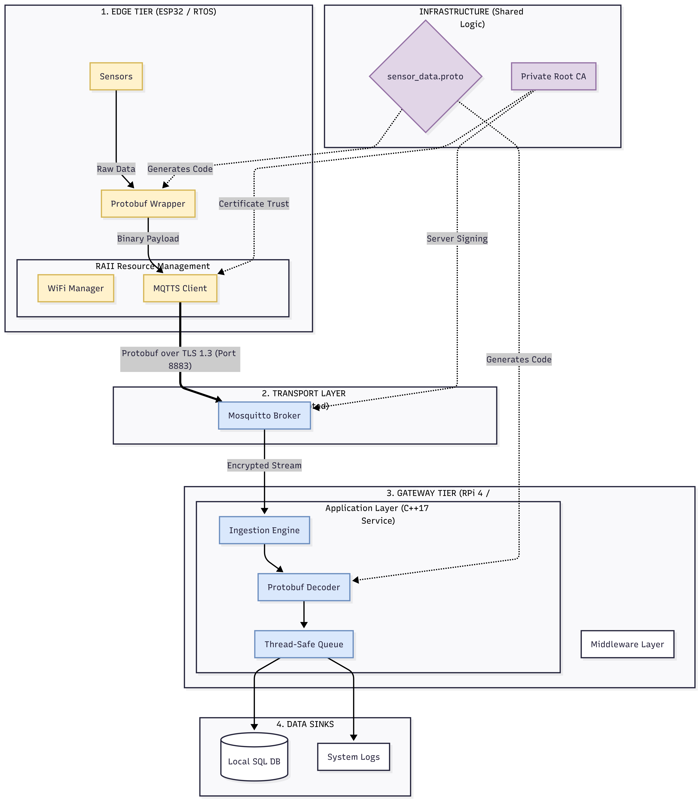

# Heterogeneous Industrial IoT Gateway

**An End-to-End Secure Telemetry System (Edge-to-Cloud)**

## Executive Summary
This project implements a secure, high-performance industrial IoT pipeline. It utilizes a **Heterogeneous Architecture** consisting of an **ESP32 Edge Node** (C++17/RTOS) communicating over an encrypted **MQTTS** tunnel to a custom **Linux Gateway** (Buildroot/AArch64).

### Key Architectural Pillars
1. **Resource Safety:** Strict RAII implementation in Modern C++.
2. **Security:** Private PKI (Certificate Authority) with TLS 1.2/1.3 encryption.
3. **Efficiency:** Nanopb-based binary serialization (75% bandwidth reduction vs. JSON).
4. **Reliability:** Custom-built Linux OS via Buildroot for deterministic gateway performance.

---

## Project Structure
- [/firmware](firmware/esp32/esp32-sensor-node) : ESP32-sensor-node ([Phase 2 Implementation](docs/phase-2-edge.md))
- [/gateway](gateway-os) : Buildroot configuration ([Phase 1 Implementation](docs/phase-1-gateway-os.md))
- [/proto](proto) : Shared Protobuf schemas (The Data Contract)
- [/security](security) : Private PKI and Infrastructure keys
- [/docs](docs) : [Gateway Service Design](docs/phase-3-gateway-service.md)

## Getting Started

### Prerequisites
- **Host:** Ubuntu 24.04 LTS
- **Toolchains:** ESP-IDF v5.x+, Buildroot 2024.02 LTS
- **Dependencies:** `cmake`, `ninja`, `ccache`, `python3-protobuf`

### Build Instructions (Edge Tier)
1. Navigate to `firmware/esp32/esp32-sensor-node`
2. Run `idf.py build`
3. Flash via `idf.py -p [PORT] flash monitor`

## Engineering Milestones
- **Dec 2025:** Established Private PKI and signed Gateway certificates.
- **Dec 2025:** Validated RAII-based hardware drivers on ESP32 silicon.
- **Dec 2025:** Achieved 75% telemetry compression using Nanopb serialization.

## Security Notice
This repository contains a **Development-only Private PKI**. The Root CA keys included in the `/security` folder are provided for architectural demonstration and build reproducibility. In a production environment, these keys would be managed by a Hardware Security Module (HSM) or a secure Vault and excluded from version control.
